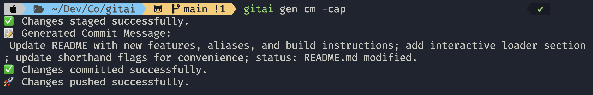

# Gitai 🤖✨

Your AI-Powered Git Companion

---

## What is Gitai?

**Gitai** is a modern CLI tool that leverages AI to help you write clear, concise, and professional git commit messages based on your repository’s changes.  
No more writer’s block or vague commit messages—let AI do the heavy lifting!

---

## Screenshot



---

## Features 🚀

- **AI-Generated Commit Messages:**  
  Generate meaningful commit messages from your git diff and status.
- **Detailed or Concise:**  
  Use `--detailed` for a more comprehensive message.
- **Automatic Staging, Commit & Push:**  
  Use `--add` to stage all changes, `--commit` to commit instantly, and `--push` to push after committing.
- **Interactive Loader:**  
  Enjoy a smooth CLI experience with a live spinner while AI works.
- **Flexible Command Structure:**  
  Use `gitai gen commit_message` (or aliases like `cm`, `cmsg`) for commit message generation.

---

## Planned Features 🛠️

- **Conventional Commit Support** 📝  
  Option to generate messages in [Conventional Commits](https://www.conventionalcommits.org/) format.
- **Branch Name Suggestions** 🌿  
  Let AI suggest branch names based on your changes.
- **Pre-commit Hook Integration** 🪝  
  Seamlessly integrate Gitai as a git pre-commit hook.
- **Commit Message Editing** ✏️  
  Approve or edit the AI-generated message before committing.
- **Multi-language Support** 🌐  
  Generate commit messages in different languages.
- **Summary/Explanation Mode** 📄  
  Summarize code changes or explain diffs in plain English.
- **History and Undo** ⏪  
  Show a history of generated messages and allow undoing the last commit.
- **Custom AI Prompts** 🛠️  
  Customize the prompt sent to the AI for tailored messages.
- **Integration with Issue Trackers** 🔗  
  Automatically reference issue numbers or pull request IDs in messages.
- **Quality Checks** ✅  
  Lint or check the generated message for length, clarity, or forbidden words.
- **Batch Mode** 📦  
  Generate commit messages for multiple commits (e.g., for rebasing or squashing).
- **Config File Support** ⚙️  
  Allow user configuration via a `.gitai.yaml` or similar file.
- **Stats and Analytics** 📊  
  Show stats about commit message usage, length, or AI performance.

---

## Installation 🏗️

### 1. Build and Install

```sh
git clone https://github.com/yourusername/gitai.git
cd gitai
make install
```

This will build and move the `gitai` binary to `/usr/local/bin/`.

### 2. Or Build Locally

```sh
make build
# Then run from ./bin/gitai or add ./bin to your PATH
```

---

## Usage 🧑‍💻

```sh
gitai gen commit_message [flags]
```

or using aliases:

```sh
gitai gen cm [flags]
gitai gen cmsg [flags]
```

### Common Flags

- `--detailed, -d`  
  Generate a more detailed commit message.
- `--add, -a`  
  Stage all changes before generating the commit message.
- `--commit, -c`  
  Commit with the generated message.
- `--push, -p`  
  Push changes after committing.

### Shorthand Usage Examples

You can combine short flags for convenience:

```sh
gitai gen cm -d
gitai gen cm -a -c
gitai gen cm -a -c -p
gitai gen cm -cap   # Equivalent to --add --commit --push
```

---

## Interactive Loader

While the AI generates your commit message, Gitai displays a live spinner for a smooth CLI experience.

---

## Help

See all commands and options:

```sh
gitai --help
gitai gen commit_message --help
```

---

## Contributing 🤝

We welcome contributions! Please see [CONTRIBUTING.md](CONTRIBUTING.md) for guidelines.

---

## License

MIT © Vusal Huseynov
